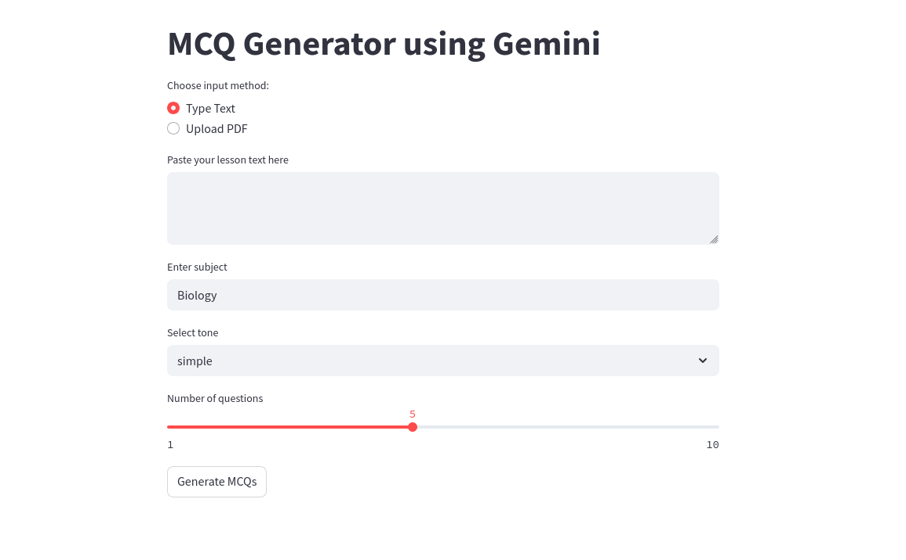
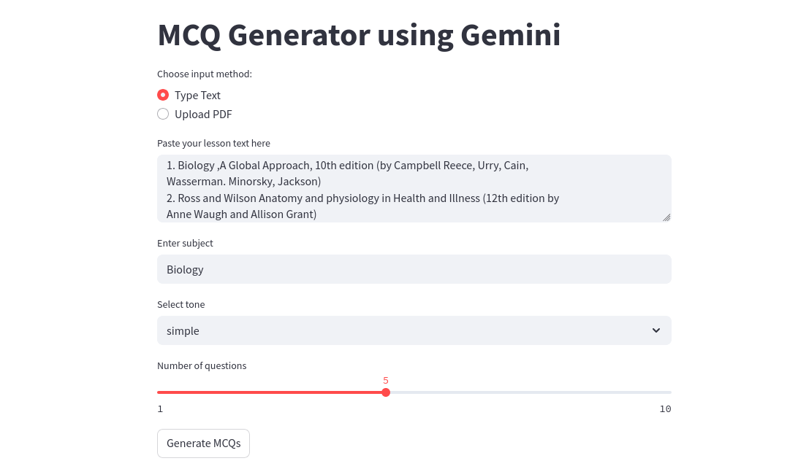
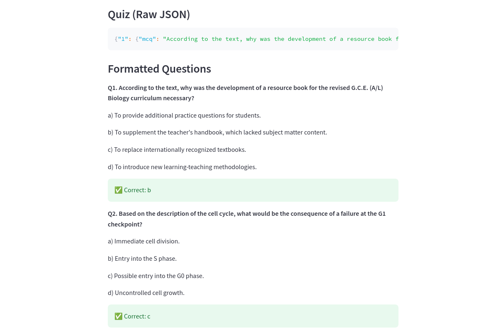

# 🧠 MCQ Generator App (G.C.E. A/L Style)

This project is a smart Multiple Choice Question (MCQ) generator tailored for **G.C.E. A/L-style exams**. It leverages **Google Gemini (1.5 Flash)**, **LangChain**, and **Streamlit** to automatically generate high-quality quiz questions from any given lesson text or uploaded PDF.

---

## 📦 Features

- 🧾 Upload PDF or paste raw text
- 🧠 Generates **conceptual A/L-style MCQs**
- ✅ Review of quiz for complexity and clarity
- 🪄 Built using Google Generative AI (Gemini 1.5 Flash)
- 🔗 Modular LangChain prompts
- 📄 Saves quiz to JSON or CSV
- ⚙️ Fully customizable (subject, tone, number of questions)

---


## 🚀 Getting Started

### 1. Clone the repository

```bash
git clone https://github.com/FathimaHusna/MCQ_Generator
cd MCQ_Generator

### 2. Create and activate virtual environment
python -m venv venv
source venv/bin/activate  # Linux/macOS
venv\Scripts\activate     # Windows

### 3. Install dependencies
pip install -r requirements.txt

### 4. Set up .env file

GOOGLE_API_KEY=your_google_generativeai_key

### 🖥️ Run the App

streamlit run StreamlitApp.py

Then open the browser at http://localhost:8501

### 🧪 Example Output

Q1. Which of the following best explains the concept of osmosis in living cells?
a) Active movement of ions
b) Passive transport of water across a membrane
c) Conversion of glucose into energy
d) Diffusion of carbon dioxide

✅ Correct: b

## 📸 Screenshot








### 🛠️ Tech Stack

    🔮 Google Generative AI (Gemini)

    🧩 LangChain

    📘 Streamlit

    🐍 Python, dotenv, pandas, PyPDF2

